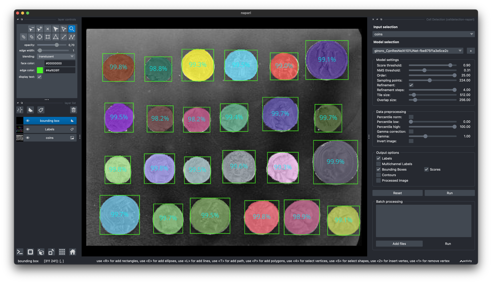

# Cell Detection - Napari Plugin

A napari plugin based on [PyTorch](https://pytorch.org) and the [``celldetection``](https://github.com/FZJ-INM1-BDA/celldetection) package.

## Installation

Make sure you have [PyTorch](https://pytorch.org/get-started/locally/) installed.
```
pip install git+https://github.com/FZJ-INM1-BDA/celldetection-napari.git
```

## Start
To start napari with the Cell Detection Plugin use this command:
```
napari -w celldetection-napari
```

Napari is shipped with example images, e.g. `coins.png` (`File > Open Sample > napari > Coins`).


